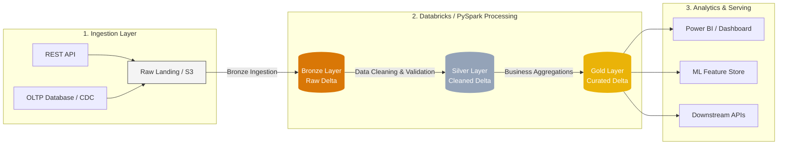

```mermaid
flowchart LR
    %% Data Sources
    subgraph Sources["1. Ingestion Layer"]
        A1[REST API] --> B[Raw Landing / S3]
        A2[OLTP Database / CDC] --> B
    end

    %% Processing & Storage
    subgraph Processing["2. Databricks / PySpark Processing"]
        B -->|Bronze Ingestion| C[(Bronze Layer\nRaw Delta)]
        C -->|Data Cleaning & Validation| D[(Silver Layer\nCleaned Delta)]
        D -->|Business Aggregations| E[(Gold Layer\nCurated Delta)]
    end

    %% Consumption
    subgraph Consumption["3. Analytics & Serving"]
        E --> F[Power BI / Dashboard]
        E --> G[ML Feature Store]
        E --> H[Downstream APIs]
    end

    %% Node Styling
    style B fill:#f4f4f4,stroke:#333,stroke-width:1px
    style C fill:#d97706,color:#fff,stroke-width:0px
    style D fill:#94a3b8,color:#fff,stroke-width:0px
    style E fill:#eab308,color:#fff,stroke-width:0px
```
